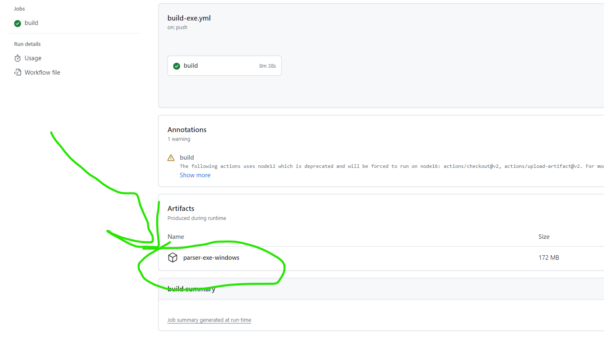

## Intro

Welcome to the folder containing all the BENNESAW BATE Racing data acquisition services. The entire system is Python and MatLab based.


  - If you have any questions or need troubleshooting, feel free to reach out to Matthew Samson on Teams, Discord: mathbrook or via email: <msamson1@students.kennesaw.edu>

# parser setup

the parser is the tool to decode our vehicle [CAN](https://www.csselectronics.com/pages/can-bus-simple-intro-tutorial) logs, which look like this:

```
time,msg.id,msg.len,data
1698174558627,C0,8,0000000001020000
```

into this:

```
time,id,message,label,value,unit
2023-10-24T19:09:18.627Z,0xC0,M192_Command_Message,Torque_Command,0.0,Nm
```

there are two options for using the parser:

1. download and extract the executable to run standalone (simplest but requires updates)

2. install python, clone repo, install packages and run script (more complicated but easier to update)

### downloading executable

1. go to <https://github.com/KSU-MS/KS5e-Data-Logging/actions/workflows/build-exe.yml?query=branch%3Adevelop+branch%3Amain++>
    - you should see this: 
2. click the workflow run (in this case `Merge pull request...`)

3. scroll down to the bottom of the page and click the artifact to download it:
    - 
    - your browser may alert you that you are downloading a virus, but trust the download and let it continue

4. once that download is complete, extract the contents of the .zip file to a folder
5. run `parser_exe.exe`


### manual python install

1. Python 3 is required, and may be installed here: <https://www.python.org/downloads/>. Make sure it is added to PATH
    - Python 3.8 is recommended to guarantee compatibility
2. For MatLab (OPTIONAL), you will need an education/work license to get it for free. Follow KSU's instructions here: <https://www.mathworks.com/academia/tah-portal/kennesaw-state-university-31081932.html>
    - Really the only thing you need MatLab for is to plot the data after parsing. Otherwise, just having Python is enough
3. If you have not done so already, clone this GitHub repo or download it as a zip, extract, and save to somewhere safe
4. Change directory to the repo. All you have to do is `cd KS5e-Data-Logging`
5. optional step, create a python virtual environment by running these commands:

```python
pip install virtualenv
python -m virtualenv venv
.\venv\scripts\activate
pip install -r requirements.txt
```

<https://stackoverflow.com/questions/41972261/what-is-a-virtualenv-and-why-should-i-use-one>

6. Once you are here, download the needed pip libraries by issuing the command `pip install -r requirements.txt`

## User's Guide

If you are a user, everything you need to care about is in the `telemetry_exe` folder. Navigate to that directory.

There are two services: the **Live Console**, the **Parser and Plotter**


### Parser and Plotter

1. Get the raw data CSVs from the SD card on the vehicle
2. Copy them to a folder on your computer
   
 
3. If you chose to manually set up the parser, you can either run the file `parser_exe.py` with the Python Interpreter or issue the command `python parser_exe.py`
4. Otherwise if you downloaded the executable, run `parser_exe.exe`
5. Wait for the process to finish (a success message from `parser_exe.py` followed by termination)
6. You may now retrieve the parsed data from the `parsed-data` as well as the `temp-parsed-data` folder and the .mat file `output.mat`
   - logs in `parsed-data` are formatted differently than in `temp-parsed-data`, but the results are the same

If you run the parser in the same raw data folder again, it will overwrite the files in `parsed-data` and `temp-parsed-data`

_The next steps are optional - only if you want to plot the results_

6. Open `dataPlots.m` in MatLab
7. In MatLab, first load `output.mat` by double clicking it on the sidebar. Then click run on `dataPlots.m`
    - This script will not execute fully if there is not enough data, and it will stop on the first plot it is missing data for

### Live Console

1. Either run the file `console_exe.py` with the Python Interpreter or issue the command `py -3 console_exe.py`
2. Select your source of data input and run it
   - currently the only working data source is "teensy"
